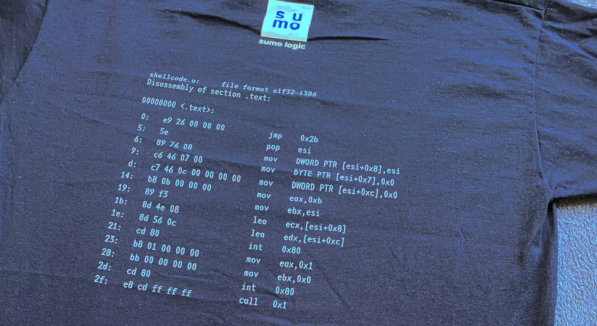

My company sent me recently this wonderful t-shirt:



The text printed on it looks very much like the output of `objdump -d shellcode.o` command.

Let's figure out if the shellcode actually works.

If you had a chance to write your own shellcode, you will immediately recognize this `jmp`, `call`, `pop` pattern.
In pure form it looks like this (NASM syntax):
```asm
        jmp short _end
_run:
        pop esi
        ; now esi register contains address of data label

        ; actual shellcode instructions go here
_end:
        call _run 

data:
        db 'some data'
```
When we use shellcode on a real system, we have no idea at which memory address our shellcode will be located. Sometimes this information can be very useful e.g. when our shellcode contains not only code but also data.
While `jmp`s and `call`s can operate on relative addresses, thus allowing us to write position independent code (PIC), the data access instructions (`mov`s) need absolute addresses. 

NOTE: The last sentence is no longer true on x86_64 architecture, as it introduced a new addressing mode called "RIP relative addressing".

When we use `jmp` and `call` instructions in relative address mode, we are actually using offsets relative to the _next_ instruction following `jmp` or `call` opcode.
So a relative jump `jmp short 0` (again NASM syntax), will just jump to the next instruction.

`call offset` instruction is more interesting, as it will not only jump to the offset, but also will push the address of the following instruction on the stack (the so called return address).

Now we can understand how `jmp`, `call`, `pop` pattern works.
First we need to position `call` instruction just before the data, of which we want to get the address. Then we do a relative jump to the `call`. The `call` will put the address of the next instruction (in this case our data) on the stack and will again do a relative jump to the specified offset. Now we have the address of our data on the stack, so we may just `pop` it into a register of our choice :tada:

When we take a look at the t-shirt again, we may notice that the actual offsets printed there are wrong. `jmp 0x2b` should be in fact `jmp 0x2a` because the address of `call` instruction is `0x2f = 0x05 + 0x2a`. The `call` instruction on the other hand should jump to the `pop esi` instruction, so the offset should be `0x2f (call addr) + 0x05 (length of call instruction) + offset = 0x05`, or `-0x2f` (using 2's complement this value can be represented as `0xffffffd1`).

Right after `pop esi` we have sequence of three move instructions:
```asm
	mov    dword ptr [esi+0x8], esi
	mov    byte  ptr [esi+0x7], 0x0
	mov    dword ptr [esi+0xc], 0x0
```
We know now that `esi` points to the area after our last shellcode instruction.
We may illustrate this area as:
```
ESI+0: ??|??|??|?? 
ESI+4: ??|??|??|??
ESI+8: ??|??|??|??
ESI+c: ??|??|??|??
```
After executing all these move instructions (in intel syntax that we have here it is always `mov dest, src`) our memory area will look like this:
```
ESI+0: ??|??|??|?? 
ESI+4: ??|??|??|00
ESI+8: [value of esi register]
ESI+c: 00|00|00|00
```

Now this is interesting. Looks like we have a seven character string terminated by zero, then a pointer to that string and a `NULL` value.

:thinking: Seven character string, seven character string...  when it is about shellcodes it must be `/bin/sh` :D So it looks like the shellcode on the t-shirt is truncated, the last two instruction should look like this:
```asm
	call 0xffffffd1 ; must be a relative call
	db  '/bin/sh'
```
And our mysterious memory area should be:
```
ESI+0: /|b|i|n 
ESI+4: /|s|h|00
ESI+8: [value of esi register]
ESI+c: 00|00|00|00
```

Now that we know what the missing bytes are, we may expect that our shellcode is calling one of the `execve` functions.
In C `execve` is declared in `unistd.h` as:
```c
int execve(const char *path, char *const argv[], char *const envp[]);
```
It takes three parameters that should be know to every C programmer out there.
Both `argv` and `envp` arrays contain pointers to strings and must be terminated
by an entry containing `NULL`. Here is how we may use `execve` in C:
```c
int main(int argc, char** argv) {
	char* args[] = { "/bin/sh", NULL };
	char* env[] = { NULL };
	execve(args[0], args, env);
}
```
Actually when `env` is empty we may compress this code a bit (by reusing null already present in `args` array):
```c
int main(int argc, char** argv) {
	char* args[] = { "/bin/sh", NULL };
	execve(args[0], &args[0], &args[1]);
}
```
Notice that `args` array looks similar to our memory area starting at `ESI+8`.


